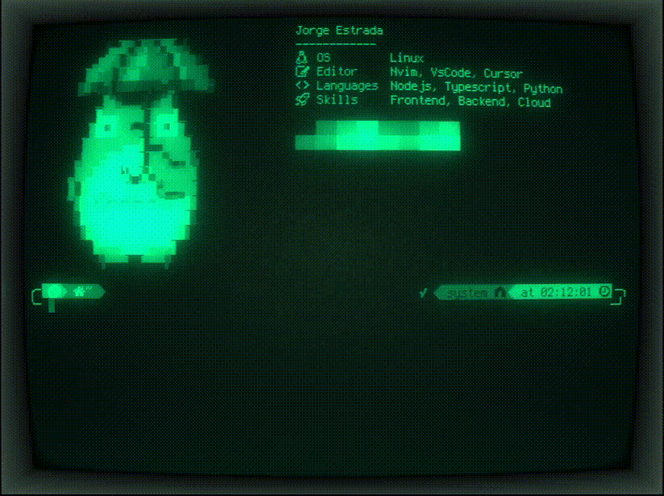

<!-- Tagline -->

  <b>🚀 Full‑Stack Developer · 🧩 Tech Lead · 🧠 AI & Automation</b>

  <a href="mailto:jor1550g@gmail.com">📧 Email</a> •
  <a href="https://www.linkedin.com/in/jorge-estrada-vidal">💼 LinkedIn</a> •
  <a href="https://github.com/pucodev">🐙 GitHub</a>

---

## 👋 Hi, I'm Jorge Estrada Vidal

I’m a **Fullstack Developer** with over **10 years of experience**, specializing in **Frontend with Vue and React** and with a strong background in **Backend with Django, Flask, Laravel, and NestJS**.

I have led teams, designed **microservices architectures**, integrated **artificial intelligence**, and built **large-scale automation platforms** for both enterprises and startups.

I have also **founded several startups** with presence in multiple countries, including **Chile, Peru, Mexico, Puerto Rico**, among others.

> [!IMPORTANT]
> 🎯 I build scalable, high-performance digital products — from idea to production — blending frontend elegance with backend robustness.

---

## 🛠 Tech Stack & Skills

### 💻 Frontend

### ⚙️ Backend

### ☁️ Infra & DevOps

### 🧠 Other Skills

- **Microservices Architectures**
- **AI Integration** (LLMs, data processing, intelligent chatbots)
- **Automation with n8n**
- **Mentorship and Technical Leadership**

---

## 📈 My Experience

- 🏗 **20+ Projects** developed from start to finish.
- 🚀 **Startups**: Built fast and scalable MVPs.
- 🧑‍💻 **Technical Leadership**: Coordinated multidisciplinary teams.
- ⚡ **Performance**: Optimized frontends and APIs for high traffic loads.

---

## 📊 GitHub Stats

  
  

---

## 🌎 Contact

- 💼 LinkedIn: [https://www.linkedin.com/in/jorge-estrada-vidal/](https://www.linkedin.com/in/jorge-estrada-vidal/)
- 📧 Email: [jor1550g@gmail.com](mailto:jor1550g@gmail.com)

---

  <i>“🚀 Technology is the art of turning problems into opportunities.”</i>

